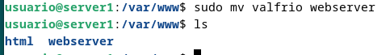
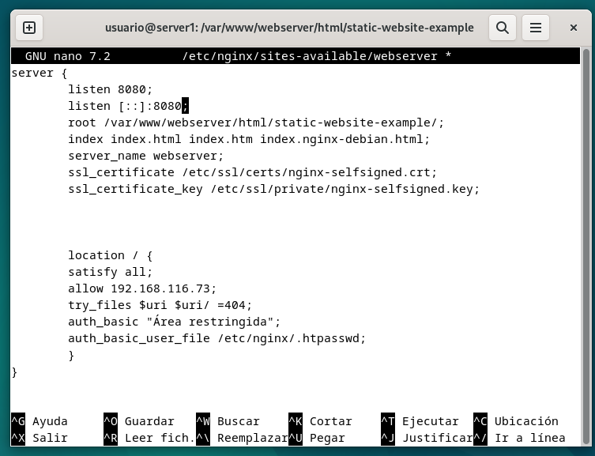
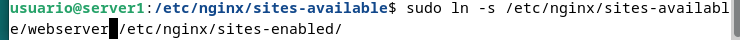

# Práctica 2.3 – Proxy inverso con Nginx
## Configurar el webserver
Para configurar el webserver debemos de hacer dos cosas. La primera es cambiarle el nombre al servidor a webserver tanto
en los archivos de configuración de site-enabled de nginx como en site-available, así como en /var/www. Después debemos de cambiar el archivo de
configuración para ajustarlo a su nuevo rol. 

Para ello primero debemos de deshacer el enlace simbólico entre las dos carpetas y modificar el nombre del servidor.

después cambiamos el nombre

Ahora vamos a cambiar el nombre del servidor en su archivo de configuración a webserver. Ahora escuchará las peticiones del
puerto 8080, de forma que el archivo de configuración queda como:

Ahora solo queda crear de nuevo el archivo de configuración en site-available mediante un enlace simbólico y reiniciar nginx

## Configurar el proxy-inverso

## Comprobación con cabeceras