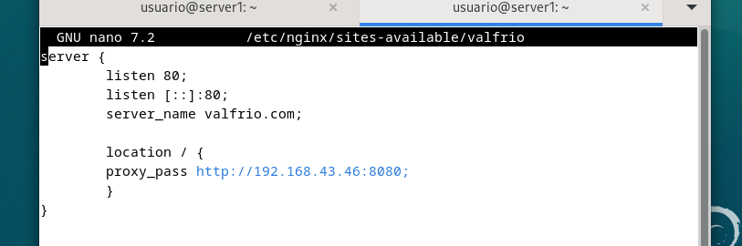
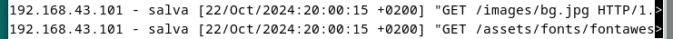
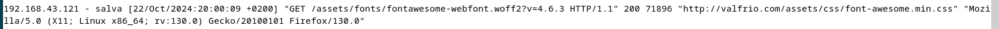
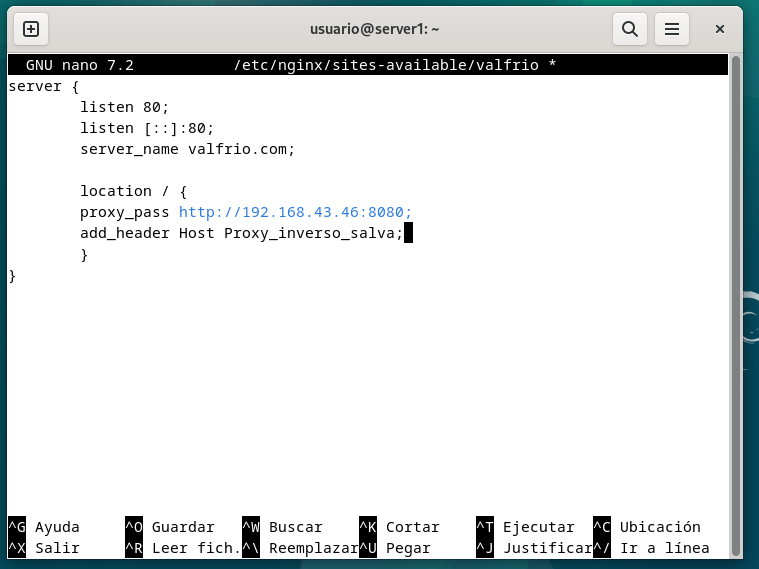
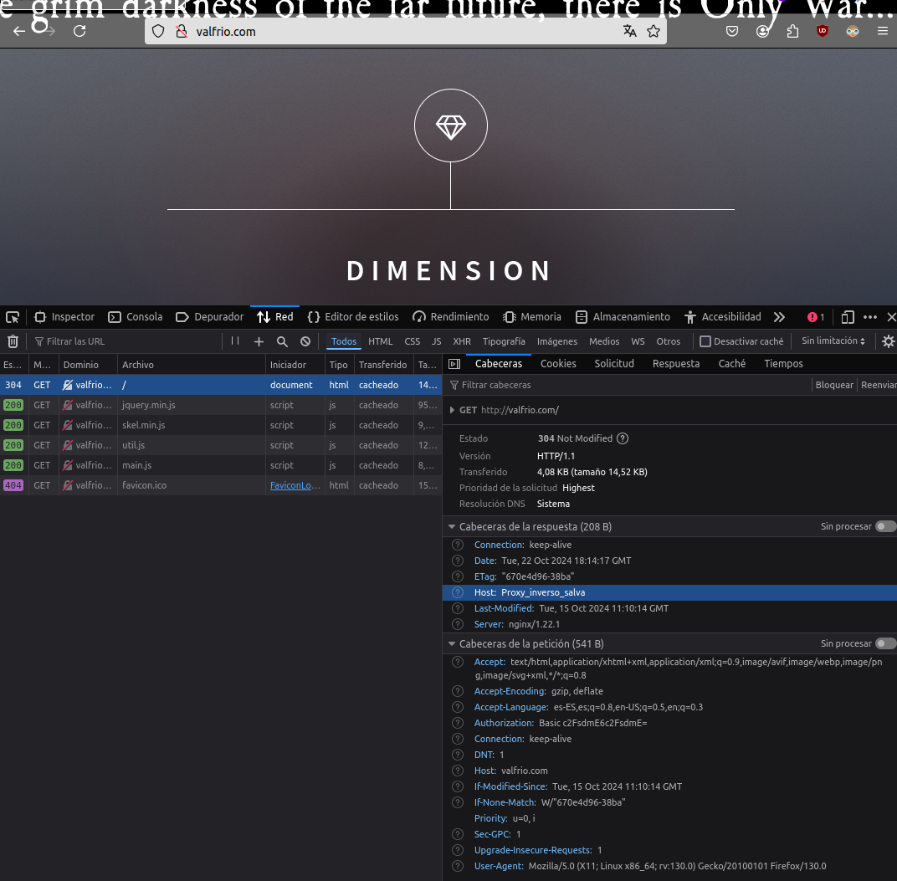
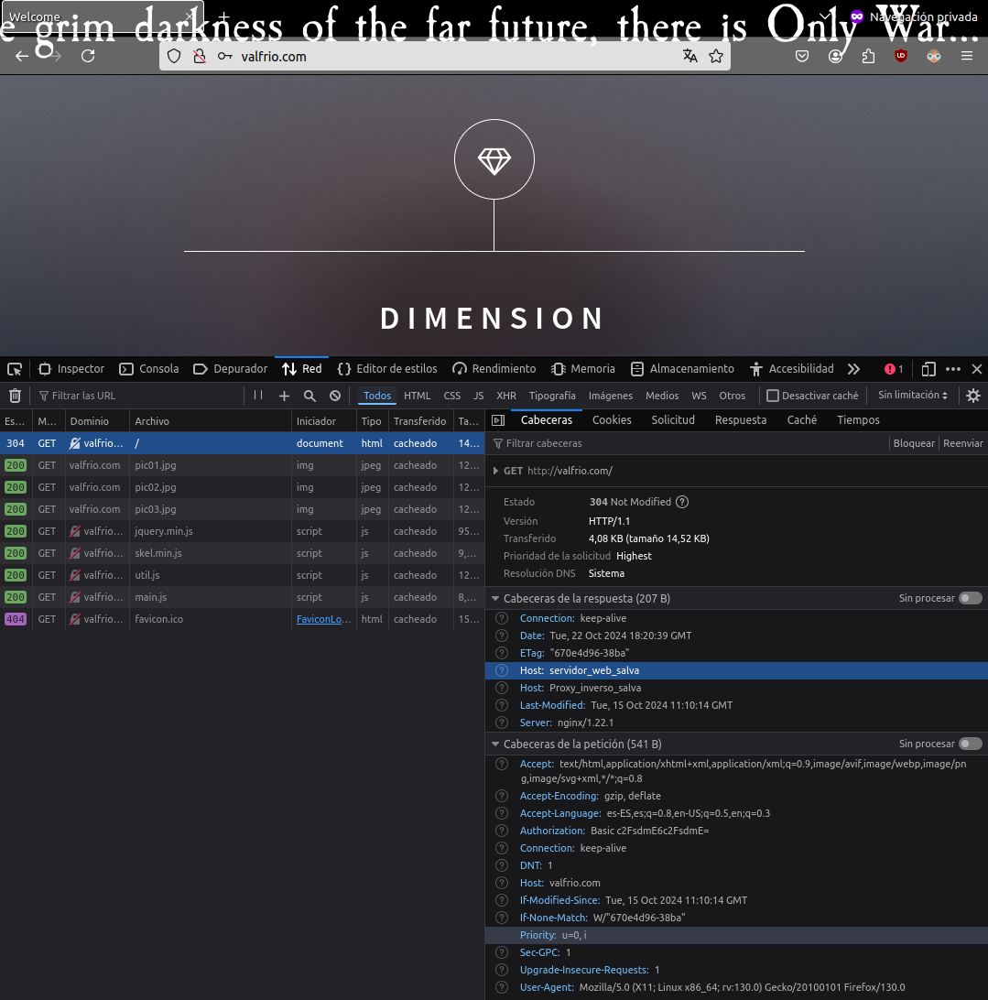

# Práctica 2.3 – Proxy inverso con Nginx

Para ello debemos de clonar nuestra máquina con el servidor nginx de la práctica anterior. Una de las dos hará de webserver y otra del
proxy que redirigirá el trafico. Para toda la configuración es ideal tener las dos máquinas virtuales encendidas.

## Configurar el webserver
Para configurar el webserver debemos de hacer dos cosas. La primera es cambiarle el nombre al servidor a webserver tanto
en los archivos de configuración de site-enabled de nginx como en site-available, así como en /var/www. Después debemos de cambiar el archivo de
configuración para ajustarlo a su nuevo rol. 

Para ello primero debemos de deshacer el enlace simbólico entre las dos carpetas y modificar el nombre del servidor.

después cambiamos el nombre

Ahora vamos a cambiar el nombre del servidor en su archivo de configuración a webserver. Ahora escuchará las peticiones del
puerto 8080, de forma que el archivo de configuración queda como:

Ahora solo queda crear de nuevo el archivo de configuración en site-available mediante un enlace simbólico y reiniciar nginx

## Configurar el proxy-inverso

Ahora debemos de cambiar el nombre del archivo de configuración a valfrio-proxy (cualquier nombre que elijas-proxy) y cambiar el archivo de configuración.
Ahora escuchará las peticiones del puerto 80 y las reenviará al webserver

La linea proxy_pass se encarga de la redirección, haciendo una petición http a la ip de nuestro servidor en el puerto 8080. Ahora podemos ver los logs de acceso
de los dos servidores para ver que la petición se halla pasado por el proxy. Primero el log de acceso del proxy:

y la del webserver:

## Comprobación con cabeceras

Ahora para que la comprobación sea un poco más clara vamos a usar cabeceras. Para ello debemos de modificar los archivos de configuración del proxy y el server. Para
ello debemos añadir la linea add_header Host nombre_del_host; en location para que en la petición vaya la cabecera con el nombre del host. La modificación sería algo así:

Después en el servidor igual. Ahora cuando hagamos la petición podremos ver en las herramientas de desarrollador que trae la cabecera introducida en el archivo de configuración.

Por último modificamos de la misma forma el webserver. Deberíamos recibir las dos cabeceras

